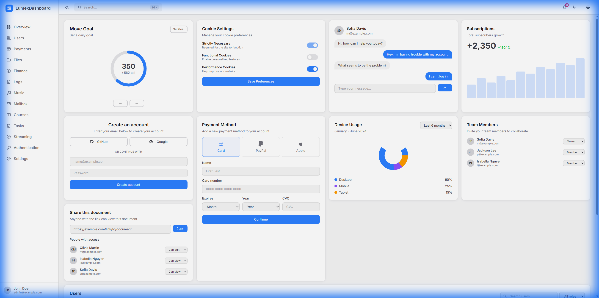
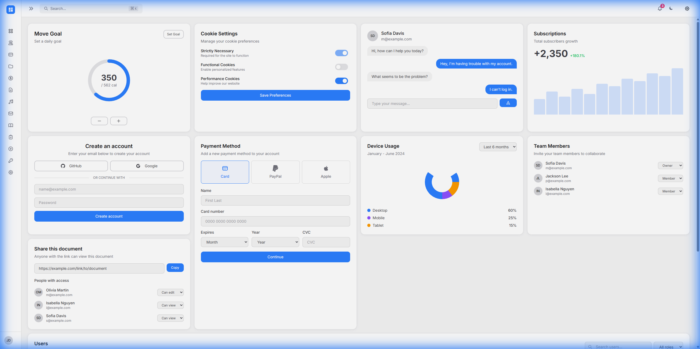
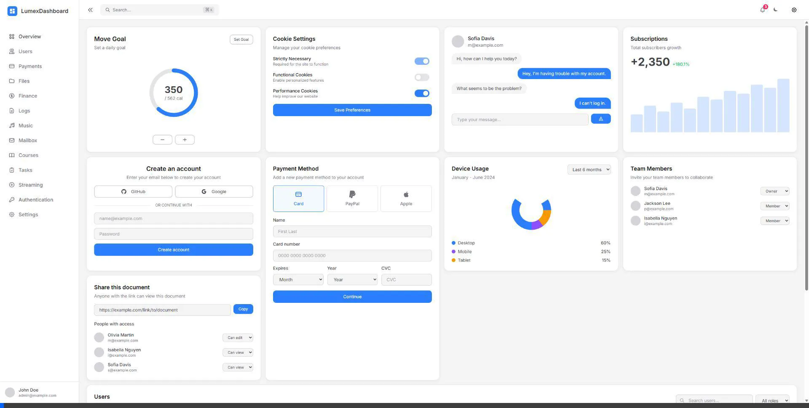

# Layout Components Refactoring Walkthrough

## Summary

Refactored all layout components (MainLayout, TopBar, NavMenu, Sidebar) to use the LumexUI `ElementClass` pattern for centralized CSS management with CSS custom properties for runtime customization.

## Changes Made

### Style Files Created

| File | Purpose |
|------|---------|
| `Styles/TopBarStyles.cs` | TopBar header, buttons, search bar |
| `Styles/NavMenuStyles.cs` | Nav items (expanded/collapsed) |
| `Styles/MainLayoutStyles.cs` | Container, content area, main padding |
| `Styles/SidebarStyles.cs` | (Previously created) |

### Components Updated

- **TopBar.razor** - Added `Class` parameter, using `TopBarStyles`
- **NavMenu.razor** - Added `Class` parameter, using `NavMenuStyles`
- **MainLayout.razor** - Using `MainLayoutStyles`
- **Sidebar.razor** - (Previously updated)

### CSS Variables Added

```css
/* TopBar */
--topbar-height: 4rem;
--topbar-button-size: 2.5rem;
--topbar-search-width-sm/md/lg: responsive widths

/* NavMenu */
--nav-item-height: 2.5rem;
--nav-item-padding-x/y: spacing
--nav-icon-size: 1.25rem;

/* Content */
--content-padding: 1rem (mobile)
--content-padding-lg: 1.5rem (desktop)
```

## Browser Testing

| State | Screenshot |
|-------|------------|
| Expanded |  |
| Collapsed |  |

### Demo Recording



## Branch

All changes committed to `feature/layout-elementclass-pattern` branch.
