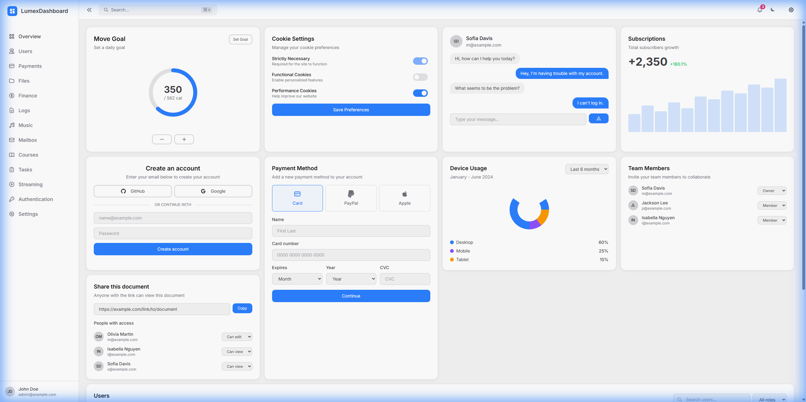
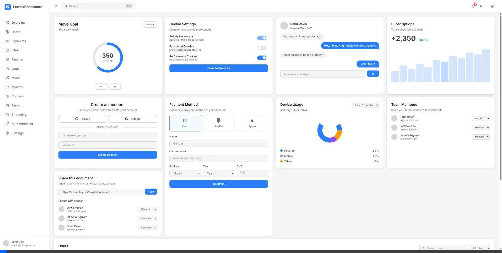

# Sidebar Customization Walkthrough

## Summary

Refactored the Sidebar component to use the LumexUI styling pattern with `ElementClass` for CSS management, and added CSS custom properties for runtime customization.

## Changes Made

### 1. Created `Styles/Sidebar.cs`
A dedicated styles file using `LumexUI.Utilities.ElementClass` for fluent CSS composition:
- Static caching for performance
- Conditional class composition with `.Add("class", when: condition)`
- Support for external class injection

### 2. Updated `Components/Layout/Sidebar.razor`
- Replaced inline class logic with `SidebarStyles.GetXxxStyles()` calls
- Added `Class` parameter for consumer customization

### 3. Added CSS Custom Properties in `wwwroot/app.css`
```css
:root {
    --sidebar-width: 16rem;
    --sidebar-collapsed-width: 5rem;
    --sidebar-transition-duration: 300ms;
    --sidebar-transition-easing: cubic-bezier(0.4, 0, 0.2, 1);
    --sidebar-logo-size: 2rem;
    --sidebar-logo-icon-size: 1.25rem;
    --sidebar-avatar-size: 2rem;
}
```

## Browser Testing

| State | Screenshot |
|-------|------------|
| Expanded |  |
| Collapsed |  |

### Demo Recording



## Commits

1. `refactor(sidebar): use LumexUI styling pattern with ElementClass`
2. `feat(sidebar): add CSS custom properties for customization`
3. `docs: add sidebar customization documentation to README`
